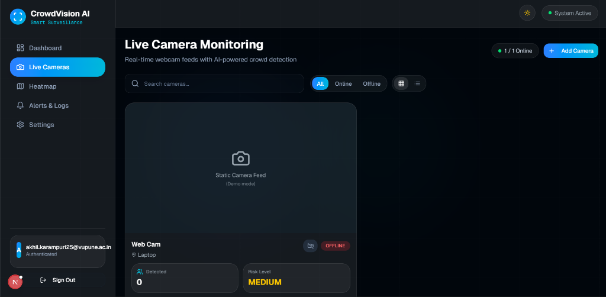
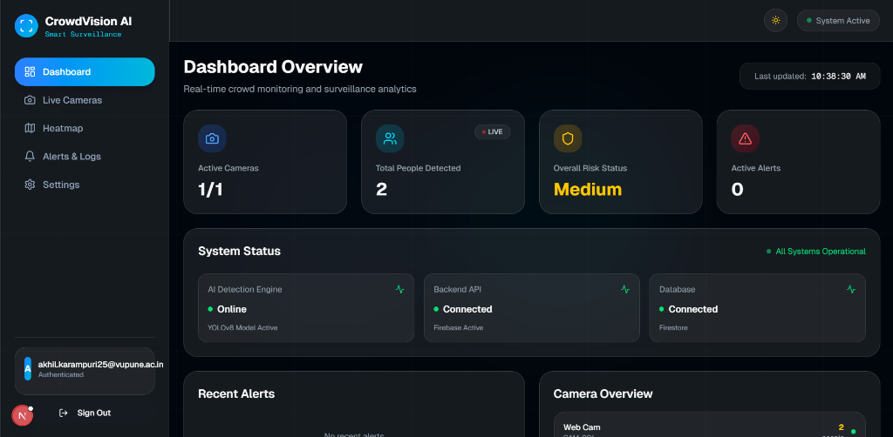
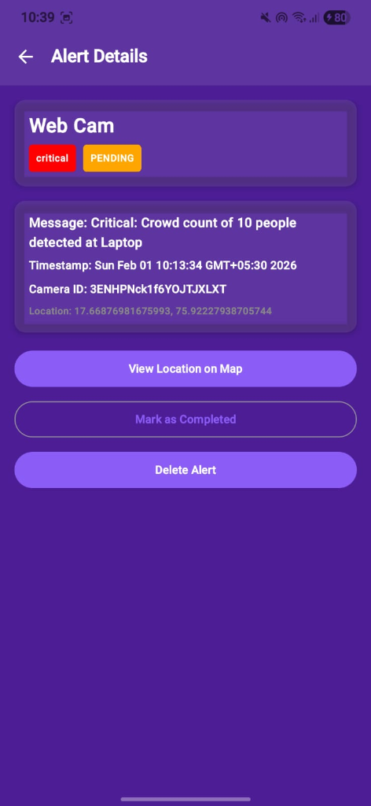
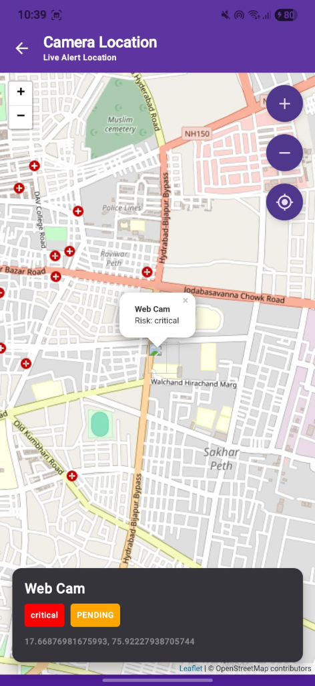
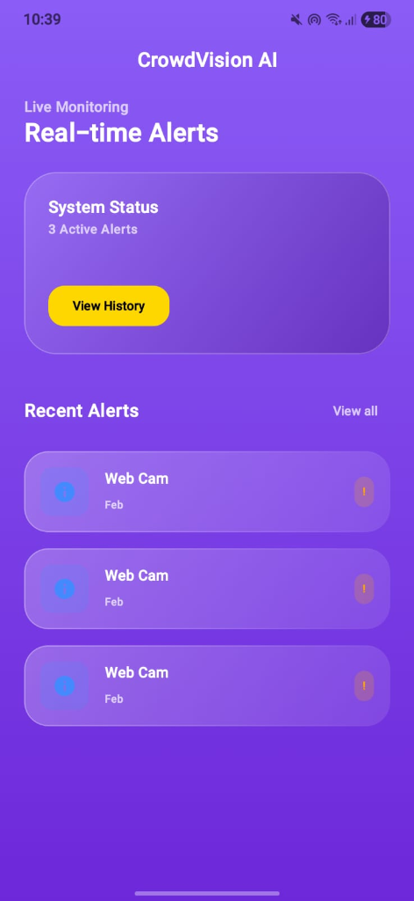

# CrowdVision AI

<div align="center">


**Next-Gen AI Powered Crowd Analysis & Public Safety System**

[](https://nextjs.org/)
[](https://www.python.org/)
[](https://firebase.google.com/)
[](https://github.com/ultralytics/ultralytics)
[](https://developer.android.com/)
[](LICENSE)

</div>

---

## 📖 Overview

**CrowdVision AI** is an advanced, real-time surveillance ecosystem designed to enhance public safety through intelligent crowd monitoring. By integrating **Computer Vision**, **Geospatial Mapping**, and **Real-time Alerting**, it transforms standard CCTV feeds into actionable safety insights.

 The system consists of three core components:
1.  **Central Command Dashboard**: A web-based control center for monitoring, analytics, and heatmap visualization.
2.  **ML Inference Server**: A high-performance Python server using YOLOv8 for person detection and crowd density estimation.
3.  **Field Officer Android App**: A dedicated mobile application for ground personnel to receive alerts and manage incidents on-site.

---

## 🌟 Key Features

### 🖥️ Web Command Dashboard
<p align="center">
  
  
</p>

-   **Live Surveillance**: Real-time video feeds with bounding box augmentation for detected individuals.
-   **Leaflet Heatmap Integration**: Interactive geospatial map showing real-time crowd density using dynamic markers and coverage circles.
-   **Intelligent Alerting**: Automatic incident generation based on crowd density thresholds.
-   **Analytics Suite**: Historical data visualization, peak hour analysis, and response time tracking.
-   **Camera Management**: Full CRUD capabilities for managing camera locations, radii, and configurations.
-   **Role-Based Access**: Secure authentication via Firebase (Email/Password & Google OAuth).

### 📱 Field Officer Mobile App
<p align="center">
  
  
  
</p>

-   **Instant Notifications**: Push notifications for high-risk alerts assigned to specific zones.
-   **Incident Management**: View, acknowledge, and resolve alerts directly from the field.
-   **Location Services**: Integration with device GPS to show nearby alerts.
-   **Secure Login**: Field officer authentication aligned with the central system.

### 🧠 Core Intelligence (ML Server)
-   **YOLOv8 Powered**: State-of-the-art object detection optimized for speed and accuracy.
-   **Risk Assessment**: Real-time classification of crowd sizes into risk categories.
-   **Privacy Focused**: localized processing capability.

---

## ⚙️ System Configuration & Risk Logic

The system operates on a strictly defined logic to ensure consistency across the Dashboard, Map, and Alerts.

### 🚦 Risk Thresholds & Color Coding

| Crowd Count | Risk Level | Status | Visual Color | Action Triggered |
| :--- | :--- | :--- | :--- | :--- |
| **0** | **Low** | Safe | 🟢 Green (`#22c55e`) | None |
| **1 - 9** | **Medium** | Warning | 🟡 Yellow (`#eab308`) | Visual Warning |
| **10+** | **High** | **CRITICAL** | 🔴 Red (`#ef4444`) | **High Risk Alert Generated** |

### 🛠️ Alert Logic
-   **Trigger**: When `People Count >= 10`.
-   **Cooldown**: 60 seconds per camera (to prevent alert spamming).
-   **Storage**: Alerts are stored in the `high_risk_alerts` Firestore collection.
-   **Lifecycle**: Active -> Acknowledged -> Resolved (Moved to History).

---

## 🏗️ Technology Stack

### Frontend (Web Dashboard)
-   **Framework**: Next.js 16.0.10 (App Router)
-   **Language**: TypeScript, React 19.2.0
-   **Styling**: Tailwind CSS, Shadcn UI
-   **Maps**: Leaflet, React-Leaflet
-   **State/Data**: React Hooks, Recharts, Zod

### Backend (Inference Engine)
-   **Runtime**: Python 3.8+
-   **Framework**: Flask 3.0.0 (API)
-   **AI Model**: YOLOv8n (Ultralytics 8.3.0)
-   **Processing**: OpenCV 4.10, NumPy

### Mobile (Field App)
-   **Platform**: Android
-   **Language**: Kotlin
-   **Architecture**: MVVM, Jetpack Compose
-   **Database**: Firebase Firestore (Online), Room (Local Persistence - *Planned*)

### Infrastructure
-   **Auth & Database**: Firebase Authentication, Firestore
-   **Storage**: Firebase Cloud Storage

---

## 🚀 Getting Started

Follow these steps to set up the complete CrowdVision AI ecosystem.

### Prerequisites
-   Node.js 18+ & npm/pnpm
-   Python 3.8+ & pip
-   Android Studio (for mobile app)
-   Firebase Project Credentials

### 1. Installation & Setup

#### 📥 Clone the Repository
```bash
git clone https://github.com/yourusername/CrowdVision-AI.git
cd CrowdVision-AI
```

#### 🌐 Web Dashboard Setup
```bash
# Install dependencies
npm install

# Set up environment variables (.env.local)
# Copy your Firebase config keys here

# Run development server
npm run dev
```
*Access dashboard at `http://localhost:3000`*

#### 🧠 ML Server Setup
```bash
cd ml-server

# Create virtual environment (optional but recommended)
python -m venv venv
# Windows: venv\Scripts\activate
# Linux/Mac: source venv/bin/activate

# Install requirements
pip install -r requirements.txt

# Start the server
# Windows
start_server.bat
# Linux/Mac
./start_server.sh
```
*Server runs on `http://localhost:5000`*

#### 📱 Android App Setup
1.  Open the `android` directory in **Android Studio**.
2.  Sync Gradle project.
3.  Add `google-services.json` to the `app/` folder.
4.  Build and Run on an emulator or physical device.

---

## 📂 Project Structure

```
CrowdVision-AI/
├── app/                  # Next.js App Router (Dashboard Pages)
├── components/           # Reusable UI Components
│   ├── heatmap-view.tsx  # Interactive Map Component
│   ├── camera-feed.tsx   # Live ML Feed Component
├── lib/                  # Utilities (Firebase, Contexts)
├── ml-server/            # Python Inference Engine
│   ├── app.py            # Flask Server Entry
│   ├── models/           # YOLOv8 Weights
├── android/              # Field Officer Mobile App Source
├── public/               # Static Assets
└── SYSTEM_CONFIGURATION.md # Detailed System Docs
```

---

## 🤝 Contributing

Contributions are welcome! Please fork the repository and submit a pull request for any enhancements.

1.  Fork the Project
2.  Create your Feature Branch (`git checkout -b feature/AmazingFeature`)
3.  Commit your Changes (`git commit -m 'Add some AmazingFeature'`)
4.  Push to the Branch (`git push origin feature/AmazingFeature`)
5.  Open a Pull Request

---

## 📄 License

Distributed under the MIT License. See `LICENSE` for more information.

---

## 📞 Contact

**CrowdVision AI Team** available at [akhilkarampuri25@gmail.com](mailto:akhilkarampuri25@gmail.com)

> **"Empowering Safer Cities through Intelligent Vision"**
